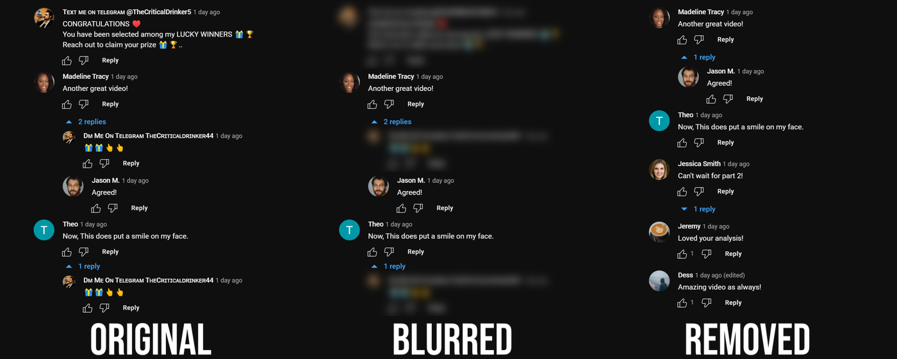

# CommentBlock

CommentBlock is an open-source browser extension that automatically blocks spam/scam YouTube comments. Download from the [Chrome Webstore](https://chrome.google.com/webstore/detail/pnhkbjdbaioddkchelkolhbhcmlibjfb).

Neural-network based detection is also in development to catch more advanced spam comments and comment threads. In particular, we aim to use unsupervised clustering techniques to group similar comments together, assign labels to comments in these groups, and then train classification models using the labelled data.

## Credit
Inspired by [ThioJoe's Spammer Purge](https://github.com/ThioJoe/YT-Spammer-Purge) tool.
